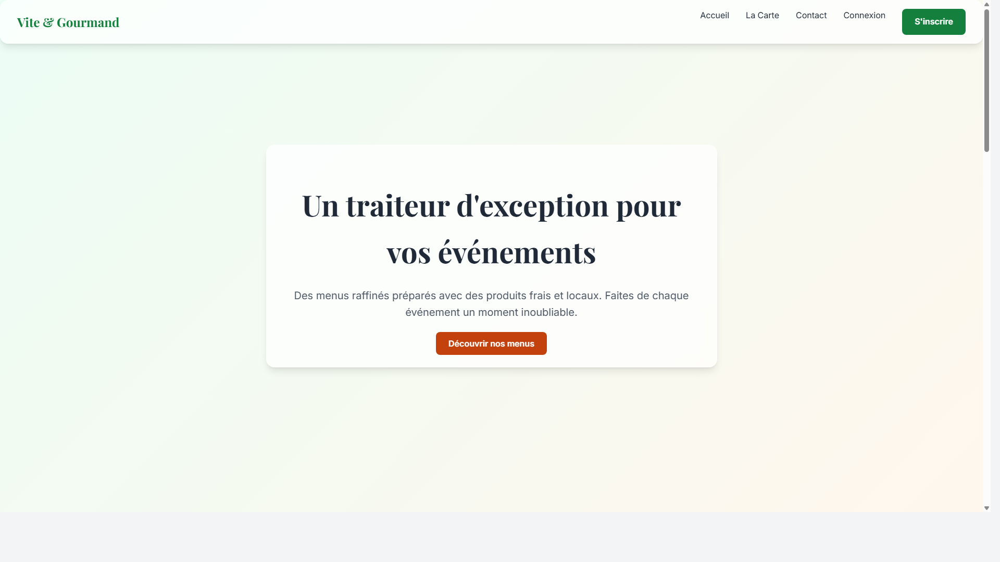

# 🥗 Vite! Gourmand - Application Traiteur

**Vite! Gourmand** est une application web moderne de **Click & Collect** pour traiteur, développée avec **Symfony 7** et **SQLite**. Elle permet aux clients de commander des repas en ligne et aux administrateurs de gérer les menus, les réservations et les stocks.



## 🌟 Fonctionnalités

### Pour les Clients
-   **Consultation des Menus** : Interface fluide pour voir les plats, entrées et desserts.
-   **Filtrage** : Allergènes et régimes alimentaires (Végétarien, Sans Gluten, etc.).
-   **Panier & Commande** : Ajout facile au panier et validation de la commande.
-   **Espace Personnel** : Suivi de l'historique des commandes.
-   **Design Moderne** : Thème sombre élégant avec animations et icônes (FontAwesome).

### Pour l'Administrateur
-   **Tableau de Bord** : Vue d'ensemble de l'activité.
-   **Gestion des Produits** : Ajout/Modification de plats avec gestion d'images.
-   **Gestion des Commandes** : Suivi des statuts (En préparation, Prête, Livrée).
-   **Horaires** : Modification des heures d'ouverture.

## 🛠️ Stack Technique

-   **Backend** : Symfony 7.0 (PHP 8.2+)
-   **Base de Données** : SQLite (Facile à déployer)
-   **Frontend** : Twig, CSS Custom (Glassmorphism), FontAwesome
-   **Assets** : AssetMapper (Pas de build complexe requis)

## 🚀 Installation Rapide

### Prérequis
-   PHP 8.2 ou supérieur
-   Composer
-   Git

### 1. Cloner le projet
```bash
git clone https://github.com/nabil77130/Vite-Gourmand-TP.git
cd Vite-Gourmand-TP
```

### 2. Installer les dépendances
```bash
composer install
```

### 3. Configurer la Base de Données
Le projet utilise SQLite, donc aucune configuration complexe n'est requise.
```bash
# Créer la base de données
php bin/console doctrine:database:create

# Exécuter les migrations
php bin/console doctrine:migrations:migrate
```

### 4. Charger les Données de Test (Fixtures)
Pour avoir des menus, des images et des utilisateurs de test :
```bash
php bin/console doctrine:fixtures:load
```

### 5. Lancer le Serveur
```bash
php -S 127.0.0.1:8000 -t public
```
Accédez ensuite à **http://127.0.0.1:8000**.

## 🔑 Accès par Défaut

**Administrateur :**
-   **Email** : `admin@vite-gourmand.com`
-   **Mot de passe** : `password`

**Utilisateur Test :**
-   **Email** : `user@vite-gourmand.com`
-   **Mot de passe** : `password`

## 📄 Documentation

-   **Manuel Utilisateur** : [Manuel_Utilisation.pdf](docs/Manuel_Utilisation.pdf) (Inclus dans le repo)
-   **Charte Graphique** : [Charte_Graphique_Final_v4.pdf](docs/Charte_Graphique_Final_v4.pdf)
-   **Documentation Technique** : [Documentation_Technique.pdf](docs/Documentation_Technique.pdf)

---
*Projet réalisé dans le cadre du TP de Développement Web.*
